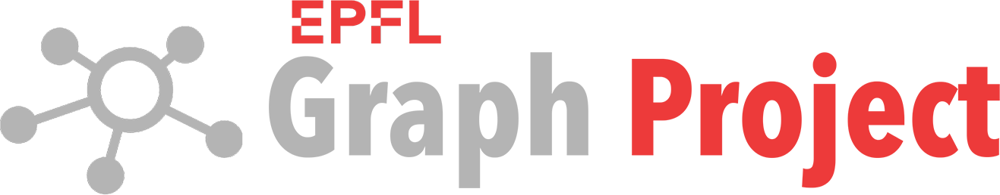

=

🏠 Graph Project

**List of core services:** 
[Registry](https://github.com/epflgraph/graphregistry) |
[AI](https://github.com/epflgraph/graphai) |
[Ontology](https://github.com/epflgraph/graphontology) |
[Search](https://github.com/epflgraph/graphsearch_ui) |
[Chat](https://github.com/epflgraph/graphchatbot)

**List of utilities:** 
[Dash](https://github.com/epflgraph/graphdashboard) |
[DB client](https://github.com/epflgraph/graphdb-client) |
[ES client](https://github.com/epflgraph/graphes-client) |
[SDK](https://github.com/epflgraph/graph-sdk) |
[Agents](https://github.com/epflgraph/graphagents)

 

Why Graph?
==========
The *Graph Data Platform* - developed by the AI engineering team at the [EPFL Center for Digital Education](https://www.epfl.ch/education/educational-initiatives/cede/) - is an open-source alternative to proprietary research information systems like Elsevier Pure. It federates educational and institutional data into a semantically interconnected knowledge graph of people, publications, labs, startups, courses, video lectures, and other educational resources. The [GraphSearch](https://graphsearch.epfl.ch/en) application provides lightning-fast search and discovery of the knowledge graph, as well as LLM-powered [chatbot](https://graphsearch.epfl.ch/en/chatbot) interaction with the indexed resources.

How the systems interact
========================
The diagram bellow shows the five major building blocks of the Graph ecosystem and how data, queries, and AI capabilities flow between them. The high-level pipeline is:

1. **External data sources** push raw data into **Graph Registry** through its data ingestion API.
2. **Graph Registry** cleans, links, and constructs the knowledge graph, calling **Graph AI** for semantic analysis, concept detection, embeddings, and multimedia processing during graph construction.
3. The resulting **knowledge graph** is persisted and becomes a primary data source for **Graph Search**.
4. **Graph Data** (Elasticsearch + MySQL/MariaDB) provides indexed full-text/vector search and warehouse storage for **Graph Search**.
5. **Graph Search** exposes the public web UI, search autocomplete, and the Graph Chatbot; the chatbot delegates complex, multi-step questions to **Intelligent Agents**.
6. **Intelligent Agents** orchestrate LLM and tool-based reasoning, calling **Graph AI** for vector search, retrieval, and RAG construction.
7. Outputs from AI processing and RAG construction are written back into **Graph Data**, closing the loop.

Component responsibilities
--------------------------
| Component | What it does |
|-----------|--------------|
| **Graph Registry** | Ingests external data, builds and maintains the semantic knowledge graph. Contains Airflow orchestration, graph calculation logic, a data ingestion API, and the knowledge graph itself. |
| **Graph Data** | Shared data infrastructure: Elasticsearch for indexing and vector search, and MySQL/MariaDB as the data warehouse. |
| **Graph Search** | User-facing layer: GraphSearch UI, web integrations, and the Graph Chatbot. |
| **Intelligent Agents** | LLM/tool-based orchestration layer, exposing the Graph Chat API and RAG Chat API. |
| **Graph AI** | AI engine providing semantic analysis, vectorisation, multimedia processing, RAG retrieval, RAG construction, and ontology management. |

Data and control flow details
-----------------------------
### Ingestion and graph construction
External data sources feed the **Graph Registry** data ingestion API. The Registry runs ETL workflows (orchestrated by Airflow), applies graph calculation logic, and calls the **Graph AI API** for semantic enrichment — concept detection, translation, embedding, OCR, video/audio processing, and ontology mapping. The result is a curated, semantically interconnected knowledge graph.

### Search and discovery
**Graph Search** reads from two sources:
- the **knowledge graph** maintained by Graph Registry, for structured entities and relationships;
- **Graph Data**, for fast full-text/vector search, autocomplete, and chatbot context.

This dual access lets GraphSearch return both precise entity pages and ranked, recommendation-style results.

### Chatbot and intelligent agents
When a user asks a complex question in the Graph Chatbot, the request flows through the **Graph Chat API** to **Intelligent Agents**. The agent orchestration layer uses LLMs and tools to plan the answer, queries **Graph AI** for vector search/retrieval and semantic processing, and may read from the knowledge graph via Graph Search/Graph Data. Final answers are streamed back to the chatbot UI.

### AI outputs feed the data layer
**Graph AI** does not only answer queries at request time. Results from batch AI processing and RAG construction are also stored in **Graph Data** (Elasticsearch indexes and MySQL/MariaDB), so that future search and chatbot requests can reuse pre-computed vectors, embeddings, and RAG artefacts.

In short, the ecosystem splits cleanly into: data ingestion and graph construction (Graph Registry), shared data infrastructure (Graph Data), user-facing search and chat (Graph Search), agentic reasoning (Intelligent Agents), and AI/semantic capabilities (Graph AI). The arrows in the diagram represent these read, write, and call relationships that keep the platform consistent and discoverable.